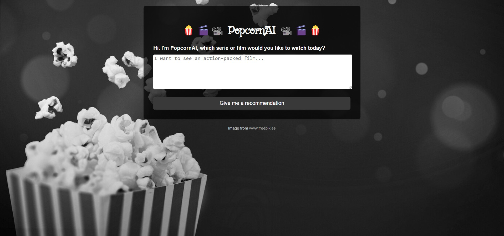

# 🍿🎬📽️ PopcornAI 📽️🎬🍿

This project uses Large Language Models (LLM) to generate personalized movie and series recommendations. The application is built with **FastAPI** and allows queries through both a web interface and an API endpoint.


## 🚀 Features

- **Web Interface**: Allows users to input queries about their movie or series preferences.
- **Personalized Recommendations**: Responds with a recommendation based on the content of the query.
- **Logs and Metrics**: Saves logs for each query, including the time and user IP address, to improve service quality.
- **Testing**: Includes automated tests to verify the correct functioning of the endpoints.

## 🛠 Technologies Used

- **FastAPI**: For building the API and web interface.
- **Uvicorn**: As the ASGI server to run the FastAPI application.
- **pytest**: For performing automated API tests.
- **Langchain**: For developing the generative AI app
- **[Cohere](#-cohere)**: AI platform designed to help developers integrate advanced natural language processing (NLP) models into their applications. In our case, we have used its LLM (large language model) and, in order to be able to use it, you will need to sign in their website and ask for an API key (there exists a free trial one).

## 🧑‍💻 Installation

Follow these steps to install and run the project locally:

1. **Clone this repository**:

    ```
    git clone https://github.com/your-username/movie-recommendations.git
    ```

2.  **Install the dependencies**:

    ```
    pip install -r requirements.txt
    ```

3. **Run the application**:

    ```
    uvicorn main:app --reload
    ```

    The application will be available at **http://localhost:8000.**

## 🐋 Docker
You can find the public Docker image [in my profile](https://hub.docker.com/u/tacedo97): 
If you prefer to run the application inside a container, follow these steps:

1. **Docker pull**
    
    ```
    docker pull tacedo97/popcorn-ai:v1
    ```

2. **Docker run**

    ```
    docker run --env-file .env -p 8000:8000 tacedo97/popcorn-ai:v1
    ```

    The application will be available at **http://localhost:8000.**


## 🧪 Tests
To run the automated tests, execute this in your terminal:

```
pytest test_api.py
```

## 🛠️ Structure of the Proyect
The repository is organised as follows:

```
📂 app-IA-generativa-recomendaciones-pelis-series
│
|── 📁 images                              # File with some images 
|
├── 📁 templates                            
│   └── index.html                          # HTML template 
│
|── .gitignore
│
|──  README.md
|
├── SQL_in_AWS_table.ipynb                 # Jupyter notebook containing the visualization of the AWS table as a df in python
│
├── aws_table_creation.py                  # Creation of the table in AWS in which the user queries, the correspondant recommendations and some addtional info are inserted
|  
├── main.py                                # Endpoints definition
|
├── requirements.txt                       
|
├── test_apy.py                            # Automated tests for checking the correct endpoints running
|
├── utils.py                               # Auxiliar functions
```

## 🤖 Cohere 

[**Official Website**](https://cohere.com/)


For running the application, an API key is needed. You can get one in the [*DASHBOARD*](https://docs.cohere.com/reference/about?_gl=1*164ftf4*_gcl_au*NDYzODc0NTA4LjE3MzI5MTMzNjA.) once you have signed in.
